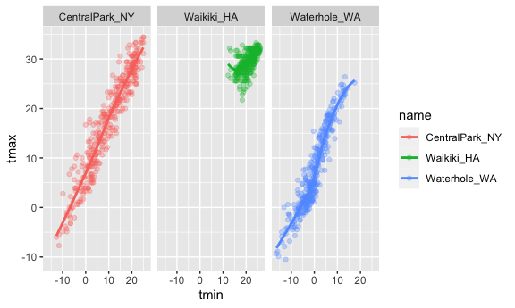
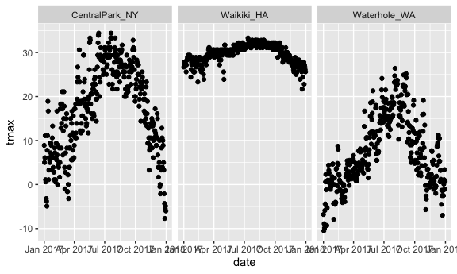
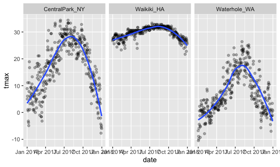
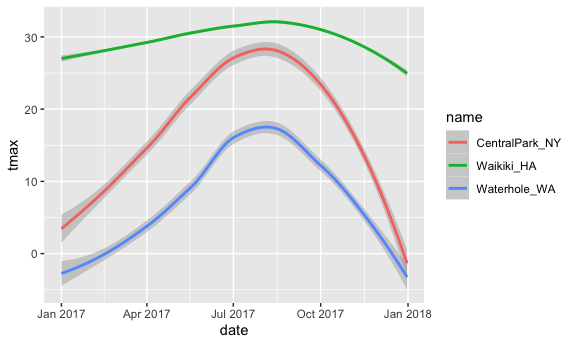
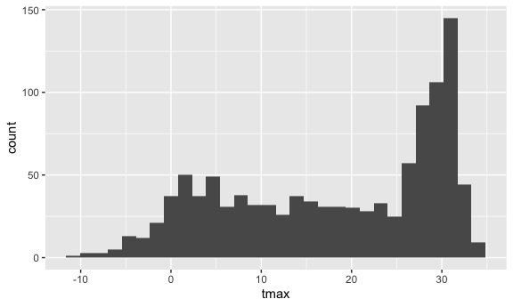
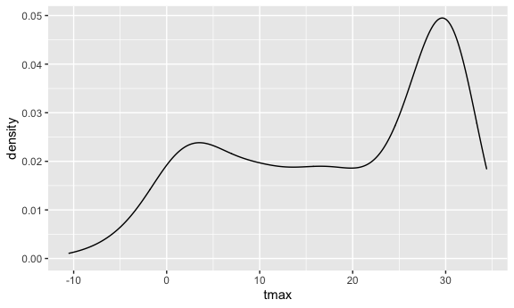
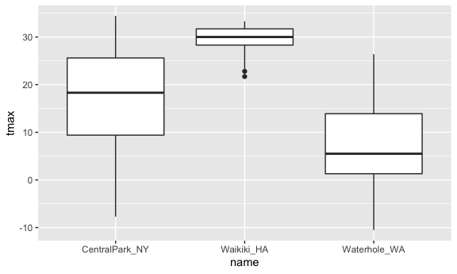
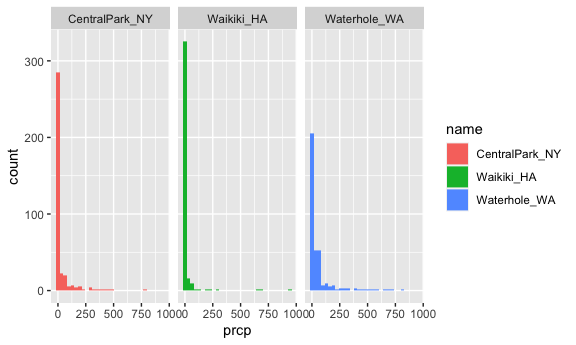

Data visualization - ggplot 1
================

Load libraries that you will need:

``` r
library(tidyverse)
```

    ## ── Attaching packages ─────────────────────────────────────── tidyverse 1.3.1 ──

    ## ✓ ggplot2 3.3.5     ✓ purrr   0.3.4
    ## ✓ tibble  3.1.3     ✓ dplyr   1.0.7
    ## ✓ tidyr   1.1.3     ✓ stringr 1.4.0
    ## ✓ readr   2.0.1     ✓ forcats 0.5.1

    ## ── Conflicts ────────────────────────────────────────── tidyverse_conflicts() ──
    ## x dplyr::filter() masks stats::filter()
    ## x dplyr::lag()    masks stats::lag()

``` r
library(ggridges)

knitr::opts_chunk$set(
  fig.width = 6,
  fig.asp = .6,
  out.width = "90%"
)
```

Load in a dataset that we will use often (copied from course webiste).
rnoaa has an online repository fo data

``` r
weather_df = 
  rnoaa::meteo_pull_monitors(
    c("USW00094728", "USC00519397", "USS0023B17S"),
    var = c("PRCP", "TMIN", "TMAX"), 
    date_min = "2017-01-01",
    date_max = "2017-12-31") %>%
  mutate(
    name = recode(
      id, 
      USW00094728 = "CentralPark_NY", 
      USC00519397 = "Waikiki_HA",
      USS0023B17S = "Waterhole_WA"),
    tmin = tmin / 10,
    tmax = tmax / 10) %>%
  select(name, id, everything())
```

    ## Registered S3 method overwritten by 'hoardr':
    ##   method           from
    ##   print.cache_info httr

    ## using cached file: ~/Library/Caches/R/noaa_ghcnd/USW00094728.dly

    ## date created (size, mb): 2021-10-05 10:29:25 (7.602)

    ## file min/max dates: 1869-01-01 / 2021-10-31

    ## using cached file: ~/Library/Caches/R/noaa_ghcnd/USC00519397.dly

    ## date created (size, mb): 2021-10-05 10:29:31 (1.697)

    ## file min/max dates: 1965-01-01 / 2020-02-29

    ## using cached file: ~/Library/Caches/R/noaa_ghcnd/USS0023B17S.dly

    ## date created (size, mb): 2021-10-05 10:29:34 (0.912)

    ## file min/max dates: 1999-09-01 / 2021-09-30

## Scatterplot

tmax vs. tmin create a ggplot object

``` r
ggp_tmax_tmin =
  weather_df %>% 
  ggplot(aes(x = tmin, y = tmax)) +
  geom_point()

ggp_tmax_tmin
```

    ## Warning: Removed 15 rows containing missing values (geom_point).


## Let’s fancy it up

Add … color? lines? other stuff? geom\_smooth(se = FALSE) adds a line
for each color geom\_point with alpha blending changes the transparency
of the dots, makes it easier to see the lines

``` r
weather_df %>% 
  ggplot(aes(x = tmin, y = tmax, color = name)) +
  geom_point(alpha = .3) +
  geom_smooth(se = FALSE)
```

    ## `geom_smooth()` using method = 'loess' and formula 'y ~ x'

    ## Warning: Removed 15 rows containing non-finite values (stat_smooth).

    ## Warning: Removed 15 rows containing missing values (geom_point).


``` r
weather_df %>% 
  ggplot(aes(x = tmin, y = tmax)) + 
  geom_point(aes(color = name), alpha = .5) +
  geom_smooth(se = FALSE)
```

    ## `geom_smooth()` using method = 'gam' and formula 'y ~ s(x, bs = "cs")'

    ## Warning: Removed 15 rows containing non-finite values (stat_smooth).

    ## Warning: Removed 15 rows containing missing values (geom_point).


``` r
weather_df %>% 
  ggplot(aes(x = tmin, y = tmax, color = name)) +
  geom_point(alpha = .3) +
  geom_smooth(se = FALSE) + 
  facet_grid(. ~ name)
```

    ## `geom_smooth()` using method = 'loess' and formula 'y ~ x'

    ## Warning: Removed 15 rows containing non-finite values (stat_smooth).

    ## Warning: Removed 15 rows containing missing values (geom_point).



Let’s make one more scatterplot.

``` r
weather_df %>% 
  ggplot(aes(x = date, y = tmax)) +
  geom_point() +
  facet_grid(. ~name)
```

    ## Warning: Removed 3 rows containing missing values (geom_point).



``` r
weather_df %>% 
  ggplot(aes(x = date, y = tmax)) +
  geom_point(alpha = .3) +
  facet_grid(. ~name) +
  geom_smooth(se = FALSE)
```

    ## `geom_smooth()` using method = 'loess' and formula 'y ~ x'

    ## Warning: Removed 3 rows containing non-finite values (stat_smooth).

    ## Warning: Removed 3 rows containing missing values (geom_point).



``` r
weather_df %>% 
  ggplot(aes(x = date, y = tmax, size = prcp)) +
  geom_point(alpha = .3) +
  facet_grid(. ~name) +
  geom_smooth(se = FALSE)
```

    ## `geom_smooth()` using method = 'loess' and formula 'y ~ x'

    ## Warning: Removed 3 rows containing non-finite values (stat_smooth).

    ## Warning: Removed 3 rows containing missing values (geom_point).


se = FALSE turns off error bars

## Use data manipulation as part of this

``` r
weather_df %>% 
  filter(name == "CentralPark_NY") %>% 
  mutate(
    tmax = tmax * (9/5) + 32,
    tmin = tmin * (9/5) + 32
  ) %>% 
  ggplot(aes(x = date, y = tmax)) +
  geom_point()
```


## Stacking geoms

Which geoms do you want?

``` r
weather_df %>% 
  ggplot(aes(x = date, y = tmax, color = name)) +
  geom_smooth()
```

    ## `geom_smooth()` using method = 'loess' and formula 'y ~ x'

    ## Warning: Removed 3 rows containing non-finite values (stat_smooth).



Geom\_hex (requires “hexbin” package)

``` r
weather_df %>% 
  ggplot(aes(x = tmax, y = tmin)) + 
  geom_hex()
```

    ## Warning: Removed 15 rows containing non-finite values (stat_binhex).


Histograms

``` r
weather_df %>% 
  ggplot(aes(x = tmax)) + 
  geom_histogram()
```

    ## `stat_bin()` using `bins = 30`. Pick better value with `binwidth`.

    ## Warning: Removed 3 rows containing non-finite values (stat_bin).



``` r
weather_df %>% 
  ggplot(aes(x = tmax, fill = name)) + 
  geom_histogram()
```

    ## `stat_bin()` using `bins = 30`. Pick better value with `binwidth`.

    ## Warning: Removed 3 rows containing non-finite values (stat_bin).


``` r
weather_df %>% 
  ggplot(aes(x = tmax, fill = name)) + 
  geom_histogram() +
  facet_grid(. ~name)
```

    ## `stat_bin()` using `bins = 30`. Pick better value with `binwidth`.

    ## Warning: Removed 3 rows containing non-finite values (stat_bin).


Let’s try some other plots…

geom\_density gives a smoothed out line

``` r
weather_df %>% 
  ggplot(aes(x = tmax)) + 
  geom_density()
```

    ## Warning: Removed 3 rows containing non-finite values (stat_density).



``` r
weather_df %>% 
  ggplot(aes(x = tmax, fill = name)) + 
  geom_density()
```

    ## Warning: Removed 3 rows containing non-finite values (stat_density).


``` r
weather_df %>% 
  ggplot(aes(x = tmax, fill = name)) + 
  geom_density(alpha = .3)
```

    ## Warning: Removed 3 rows containing non-finite values (stat_density).


Still with ‘tmax’ and ‘name’ box plots

``` r
weather_df %>% 
  ggplot(aes(x = name, y = tmax)) +
  geom_boxplot()
```

    ## Warning: Removed 3 rows containing non-finite values (stat_boxplot).



Some people like violin plots????

``` r
weather_df %>% 
  ggplot(aes(x = name, y = tmax)) +
  geom_violin()
```

    ## Warning: Removed 3 rows containing non-finite values (stat_ydensity).


What about ridges…

``` r
weather_df %>% 
  ggplot(aes(x = tmax, y = name)) +
  geom_density_ridges()
```

    ## Picking joint bandwidth of 1.84

    ## Warning: Removed 3 rows containing non-finite values (stat_density_ridges).


``` r
weather_df %>% 
  ggplot(aes(x = tmax, y = name)) +
  geom_density_ridges(alpha = .8, scale = .8)
```

    ## Picking joint bandwidth of 1.84

    ## Warning: Removed 3 rows containing non-finite values (stat_density_ridges).


## Embedding plots

``` r
weather_df %>% 
  ggplot(aes(x = tmin, y = tmax, color = name)) +
  geom_point(alpha = .3)
```

    ## Warning: Removed 15 rows containing missing values (geom_point).


``` r
weather_df %>% 
  ggplot(aes(x = tmin, y = tmax, color = name)) +
  geom_point(alpha = .3)
```

    ## Warning: Removed 15 rows containing missing values (geom_point).


## Learning Assessments

``` r
weather_df %>% 
  filter(name == "CentralPark_NY") %>% 
  mutate(
    tmax = tmax * (9/5) + 32,
    tmin = tmin * (9/5) + 32
  ) %>% 
  ggplot(aes(x = tmin, y = tmax)) +
  geom_point(alpha = .5) +
  geom_smooth(method = "lm", se = FALSE)
```

    ## `geom_smooth()` using formula 'y ~ x'


``` r
ggplot(weather_df) + geom_point(aes(x = tmax, y = tmin), color = "blue")
```

    ## Warning: Removed 15 rows containing missing values (geom_point).


``` r
ggplot(weather_df) + geom_point(aes(x = tmax, y = tmin, color = "blue"))
```

    ## Warning: Removed 15 rows containing missing values (geom_point).


Make plots that compare precipitation across locations. Try a histogram,
a density plot, a boxplot, a violin plot, and a ridgeplot; use aesthetic
mappings to make your figure readable.

``` r
weather_df %>% 
  ggplot(aes(x = prcp, fill = name)) + 
  geom_histogram()
```

    ## `stat_bin()` using `bins = 30`. Pick better value with `binwidth`.

    ## Warning: Removed 3 rows containing non-finite values (stat_bin).


``` r
weather_df %>% 
  ggplot(aes(x = prcp, fill = name)) + 
  geom_histogram() +
  facet_grid(. ~name)
```

    ## `stat_bin()` using `bins = 30`. Pick better value with `binwidth`.

    ## Warning: Removed 3 rows containing non-finite values (stat_bin).



``` r
weather_df %>% 
  ggplot(aes(x = prcp, fill = name)) + 
  geom_density()
```

    ## Warning: Removed 3 rows containing non-finite values (stat_density).


``` r
weather_df %>% 
  ggplot(aes(x = prcp)) + 
  geom_density(aes(fill = name), alpha = .5)
```

    ## Warning: Removed 3 rows containing non-finite values (stat_density).


``` r
weather_df %>% 
  ggplot(aes(x = name, y = prcp)) +
  geom_boxplot()
```

    ## Warning: Removed 3 rows containing non-finite values (stat_boxplot).


``` r
weather_df %>% 
  ggplot(aes(x = name, y = prcp)) +
  geom_violin()
```

    ## Warning: Removed 3 rows containing non-finite values (stat_ydensity).


``` r
weather_df %>% 
  ggplot(aes(x = prcp, y = name)) +
  geom_density_ridges(scale = .85)
```

    ## Picking joint bandwidth of 4.61

    ## Warning: Removed 3 rows containing non-finite values (stat_density_ridges).


``` r
weather_df %>% 
  filter(prcp > 0) %>% 
  ggplot(aes(x = prcp, y = name)) + 
  geom_density_ridges(scale = .85)
```

    ## Picking joint bandwidth of 19.7


