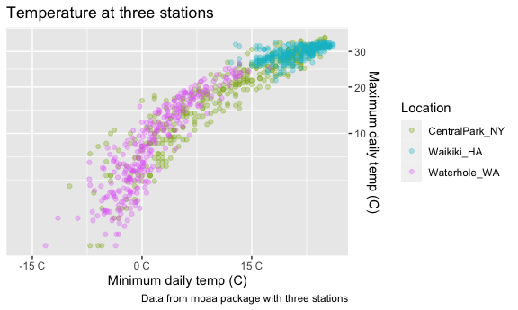
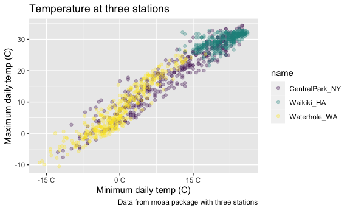
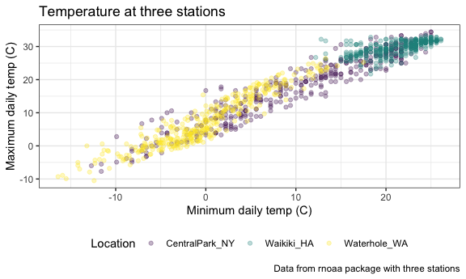
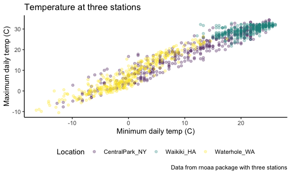
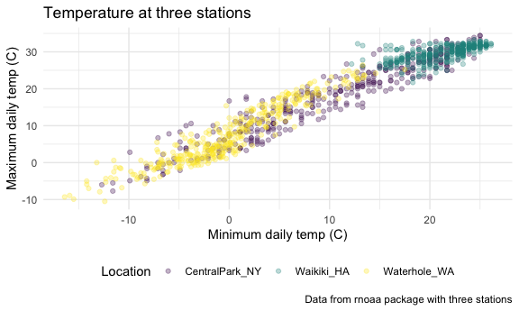

Data visualization - part 2
================

Load libraries that you will need:

``` r
library(tidyverse)
```

    ## ── Attaching packages ─────────────────────────────────────── tidyverse 1.3.1 ──

    ## ✓ ggplot2 3.3.5     ✓ purrr   0.3.4
    ## ✓ tibble  3.1.3     ✓ dplyr   1.0.7
    ## ✓ tidyr   1.1.3     ✓ stringr 1.4.0
    ## ✓ readr   2.0.1     ✓ forcats 0.5.1

    ## ── Conflicts ────────────────────────────────────────── tidyverse_conflicts() ──
    ## x dplyr::filter() masks stats::filter()
    ## x dplyr::lag()    masks stats::lag()

``` r
library(viridis)
```

    ## Loading required package: viridisLite

``` r
library(ggridges)

knitr::opts_chunk$set(
  fig.width = 6,
  fig.asp = .6,
  out.width = "90%"
)
```

## Setting options

Setting options that can be included at the beginning of any R Markdown
document We won’t load now because it will affect later examples in this
document

library(tidyverse)

knitr::opts\_chunk$set( fig.width = 6, fig.asp = .6, out.width = “90%” )

theme\_set(theme\_minimal() + theme(legend.position = “bottom”))

options( ggplot2.continuous.colour = “viridis”, ggplot2.continuous.fill
= “viridis” )

scale\_colour\_discrete = scale\_colour\_viridis\_d
scale\_fill\_discrete = scale\_fill\_viridis\_d

## Load dataset

Load in a dataset that we will use often (copied from course webiste).
rnoaa has an online repository fo data

``` r
weather_df = 
  rnoaa::meteo_pull_monitors(
    c("USW00094728", "USC00519397", "USS0023B17S"),
    var = c("PRCP", "TMIN", "TMAX"), 
    date_min = "2017-01-01",
    date_max = "2017-12-31") %>%
  mutate(
    name = recode(
      id, 
      USW00094728 = "CentralPark_NY", 
      USC00519397 = "Waikiki_HA",
      USS0023B17S = "Waterhole_WA"),
    tmin = tmin / 10,
    tmax = tmax / 10) %>%
  select(name, id, everything())
```

    ## Registered S3 method overwritten by 'hoardr':
    ##   method           from
    ##   print.cache_info httr

    ## using cached file: ~/Library/Caches/R/noaa_ghcnd/USW00094728.dly

    ## date created (size, mb): 2021-10-05 10:29:25 (7.602)

    ## file min/max dates: 1869-01-01 / 2021-10-31

    ## using cached file: ~/Library/Caches/R/noaa_ghcnd/USC00519397.dly

    ## date created (size, mb): 2021-10-05 10:29:31 (1.697)

    ## file min/max dates: 1965-01-01 / 2020-02-29

    ## using cached file: ~/Library/Caches/R/noaa_ghcnd/USS0023B17S.dly

    ## date created (size, mb): 2021-10-05 10:29:34 (0.912)

    ## file min/max dates: 1999-09-01 / 2021-09-30

Create a scatterplot and modify labels, colors, scales, etc.

``` r
weather_df %>% 
  ggplot(aes(x = tmin, y = tmax)) +
  geom_point(aes(color = name), alpha = .3) +
  labs(
    title = "Temperature at three stations",
    x = "Minimum daily temp (C)",
    y = "Maximum daily temp (C)",
    caption = "Data from rnoaa package with three stations") +
  scale_x_continuous(
    breaks = c(-15, 0, 15),
    labels = c("-15 C", "0 C", "15 C")
  ) + 
  scale_y_continuous(
    trans = "sqrt",
    position = "right"
  ) +
  scale_color_hue(
    name = "Location",
    h = c(100,300))
```

    ## Warning in self$trans$transform(x): NaNs produced

    ## Warning: Transformation introduced infinite values in continuous y-axis

    ## Warning: Removed 90 rows containing missing values (geom_point).



``` r
weather_df %>% 
  ggplot(aes(x = tmin, y = tmax)) +
  geom_point(aes(color = name), alpha = .3) +
  labs(
    title = "Temperature at three stations",
    x = "Minimum daily temp (C)",
    y = "Maximum daily temp (C)",
    caption = "Data from rnoaa package with three stations") +
  scale_x_continuous(
    breaks = c(-15, 0, 15),
    labels = c("-15 C", "0 C", "15 C")
  ) + 
  scale_color_hue(
    name = "Location",
    h = c(100,300)) +
  scale_color_viridis_d()
```

    ## Scale for 'colour' is already present. Adding another scale for 'colour',
    ## which will replace the existing scale.

    ## Warning: Removed 15 rows containing missing values (geom_point).



Viridis color palette is very distinct visually (load it in using
package above) "\_d" specifies that it is a discrete variable

## Themes

Plot elements that are not directly tied to data or geometry, just might
make the plot look nicer

Note that order matters for some of these functions. If you update the
theme to bw before you move the legend, the legend won’t move.

Themes: \_bw, \_minimal, \_classic (many more available on the internet)

``` r
weather_df %>% 
  ggplot(aes(x = tmin, y = tmax)) +
  geom_point(aes(color = name), alpha = .3) +
  labs(
    title = "Temperature at three stations",
    x = "Minimum daily temp (C)",
    y = "Maximum daily temp (C)",
    caption = "Data from rnoaa package with three stations") +
  scale_color_viridis_d(
    name = "Location") +
  theme_bw() +
  theme(legend.position = "bottom")
```

    ## Warning: Removed 15 rows containing missing values (geom_point).



``` r
weather_df %>% 
  ggplot(aes(x = tmin, y = tmax)) +
  geom_point(aes(color = name), alpha = .3) +
  labs(
    title = "Temperature at three stations",
    x = "Minimum daily temp (C)",
    y = "Maximum daily temp (C)",
    caption = "Data from rnoaa package with three stations") +
  scale_color_viridis_d(
    name = "Location") +
  theme_classic() +
  theme(legend.position = "bottom")
```

    ## Warning: Removed 15 rows containing missing values (geom_point).



``` r
weather_df %>% 
  ggplot(aes(x = tmin, y = tmax)) +
  geom_point(aes(color = name), alpha = .3) +
  labs(
    title = "Temperature at three stations",
    x = "Minimum daily temp (C)",
    y = "Maximum daily temp (C)",
    caption = "Data from rnoaa package with three stations") +
  scale_color_viridis_d(
    name = "Location") +
  theme_minimal() +
  theme(legend.position = "bottom")
```

    ## Warning: Removed 15 rows containing missing values (geom_point).


